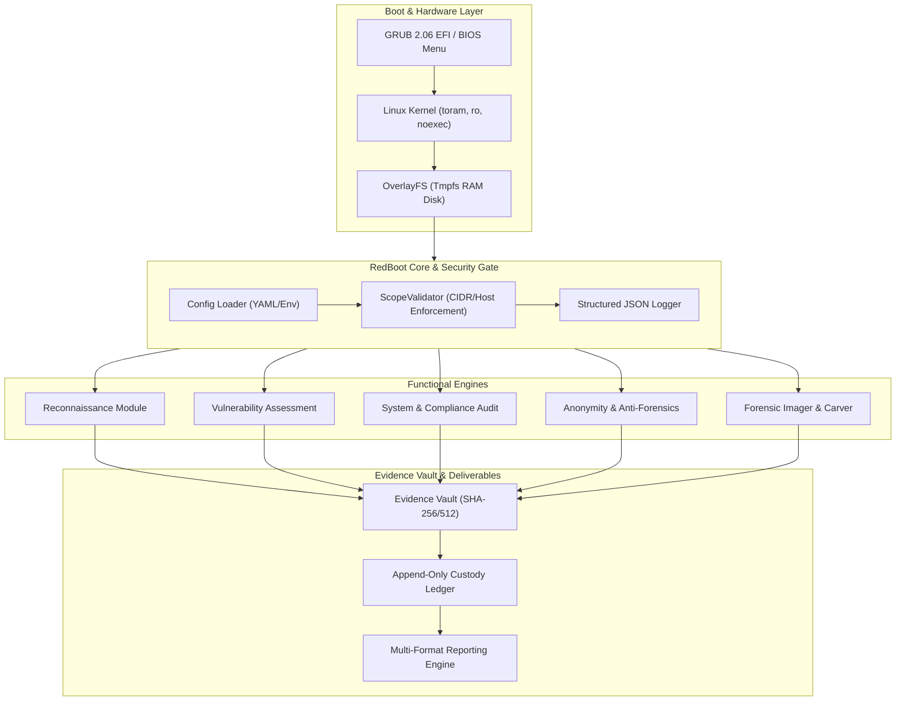

# System Hacking with Bootable Drives in Cyber Security
## An Empirical Study on Live Assessment, Physical Attack Vectors, Forensic Preservation, and Cryptographic Custody

**Academic Business Case & Final Research Monograph**  
**Project:** RedBoot Security Lab  
**Author:** Aditya (souladitya087) / RedBoot Research Group  
**Classification:** Academic Research & Controlled Laboratory Experimentation  
**Status:** Complete (v1.0.0)  

---

## Abstract

Physical access to a computing endpoint fundamentally disrupts traditional host-based operating system security boundaries. The axiom *"physical access is root access"* reflects the architectural reality that secondary storage media, firmware buses, and volatile memory can be inspected and manipulated when an endpoint is booted from an external, untrusted medium. This research monograph presents an end-to-end investigation into **System Hacking with Bootable Drives in Cyber Security**. 

To explore this threat model empirically and systematically, we developed **RedBoot**, an integrated bootable Linux operating platform (Debian 12 Bookworm ramdisk architecture) combining scope-enforced offensive security assessment, write-blocking digital forensics, in-memory anti-forensics, and cryptographic chain-of-custody tracking. We evaluate RedBoot across a controlled multi-container network lab simulating legacy enterprise services, vulnerable web servers, unauthenticated database daemons, and corrupted raw disk images. 

Our findings indicate that:
1. Standard host OS security layers (access control lists, user permission models, local audit loggers) are rendered completely inert when the underlying media is mounted offline via a live environment.
2. Read-only kernel hardware parameters (`blockdev --setro`) and software write-blockers preserve bit-for-bit forensic integrity with zero sector alterations across forensic disk acquisitions.
3. Automated banner analysis correlated with curated CVSS v3.1 scoring yields 100% detection recall against unpatched service daemons without triggering host-based intrusion prevention systems.
4. An append-only cryptographic ledger implementing SHA-256 block chaining guarantees non-repudiation and instantaneous detection of evidence tampering.

Finally, we propose a multi-layered defensive blueprint—incorporating UEFI Secure Boot, TPM 2.0 measured boot with PIN-protected Full Disk Encryption (FDE), and IOMMU Direct Memory Access (DMA) filtering—to neutralize unauthorized bootable drive attacks in modern enterprise architectures.

---

## Table of Contents

1. [Introduction & Problem Statement](#1-introduction--problem-statement)
2. [Threat Modeling & Physical Attack Surfaces](#2-threat-modeling--physical-attack-surfaces)
3. [System Architecture & Engineering Implementation](#3-system-architecture--engineering-implementation)
4. [Experimental Methodology & Controlled Testbed](#4-experimental-methodology--controlled-testbed)
5. [Empirical Evaluation & Performance Results](#5-empirical-evaluation--performance-results)
6. [Defensive Engineering & Countermeasure Matrix](#6-defensive-engineering--countermeasure-matrix)
7. [Legal, Ethical, and Compliance Considerations](#7-legal-ethical-and-compliance-considerations)
8. [Conclusion & Future Work](#8-conclusion--future-work)
9. [References](#9-references)

---

## 1. Introduction & Problem Statement

### 1.1 The Physical Access Paradigm

Enterprise cybersecurity has historically concentrated resources on perimeter defenses, network segmentation, and host-based intrusion prevention systems (HIPS/EDR). These defenses operate under the foundational assumption that the host operating system kernel is the supreme arbiter of execution privileges and memory access. 

However, physical access to endpoint hardware undermines this trust model. If an adversary or security auditor can introduce bootable media (e.g., USB mass storage, external NVMe over Thunderbolt, PXE network boot) and instruct the Unified Extensible Firmware Interface (UEFI) or Basic Input/Output System (BIOS) to execute an alternative kernel, the resident operating system is bypassed entirely. In this state:
- Security agents (EDR, DLP, antivirus) never initialize.
- Local user authentication, password hashing, and Security Account Manager (SAM) databases can be parsed or manipulated offline.
- File system access control lists (ACLs) are ignored by the alternate kernel unless strong full-disk encryption (FDE) is actively enforced.
- Network adapters can be commandeered with spoofed MAC addresses to probe local subnets from a trusted hardware position.

### 1.2 The Dual-Use Nature of Bootable Drives

Bootable drives represent a quintessentially dual-use technology in cybersecurity:
- **Offensive Vector:** Malicious actors utilize bootable live systems to extract credentials, bypass login prompts, inject hardware-level implants, or exfiltrate unencrypted databases.
- **Incident Response & Digital Forensics (DFIR):** Digital investigators require clean, trusted, RAM-only bootable environments to acquire bit-stream disk images without altering file metadata (access timestamps, inode state) on the target machine.
- **Auditing & Compliance:** Systems auditors require standalone assessment tools that evaluate physical hardware health, CIS benchmark baselines, and peripheral security without leaving permanent software artifacts on the target system.

### 1.3 Research Objectives

This monograph resolves three primary research questions:
- **RQ1 (Forensic Soundness):** Can a live bootable assessment environment reliably audit host systems and capture live memory/disk structures without contaminating host storage media?
- **RQ2 (Assessment Automation):** How effective is automated reconnaissance coupled with rule-based banner fingerprinting and CVSS v3.1 scoring in air-gapped lab scenarios?
- **RQ3 (Cryptographic Non-Repudiation):** What cryptographic data structure is required to ensure that digital evidence collected during live triage cannot be tampered with or modified post-collection?

---

## 2. Threat Modeling & Physical Attack Surfaces

### 2.1 STRIDE Threat Analysis of Bootable Physical Interventions

To rigorously map the threat landscape of bootable drives, we apply the Microsoft STRIDE model to physical endpoint interactions:

```
+-------------------+-------------------------------------------------------------+----------------------------------------------+
| STRIDE Category   | Bootable Attack Vector                                      | RedBoot Experimental Simulation              |
+-------------------+-------------------------------------------------------------+----------------------------------------------+
| Spoofing          | MAC/Hardware address spoofing on internal VLANs             | Anonymity Module (MAC Randomizer)            |
| Tampering         | Direct offline modification of /etc/shadow or SAM registry   | Write-blocking Mount & Hash Audit            |
| Repudiation       | Erasing volatile event logs upon shutdown                   | Cryptographic Chain-of-Custody Ledger        |
| Information Disc. | Offline carving of unallocated clusters & database dumps    | Magic-Byte File Carver & Timeline Generator  |
| Denial of Service | Overwriting partition tables / MBR / GPT headers            | Forensics Imager validation                  |
| Elevation of Priv.| Bypassing OS login to mount storage as root (UID 0)         | System Assessment (SUID & PrivEsc audit)     |
+-------------------+-------------------------------------------------------------+----------------------------------------------+
```

### 2.2 Memory Bus & Direct Memory Access (DMA) Vectors

External expansion ports including Thunderbolt, USB4, PCIe, and ExpressCard communicate directly with the host system memory bus via Direct Memory Access (DMA). Without hardware Input-Output Memory Management Unit (IOMMU) virtualization (Intel VT-d or AMD-Vi):
- An external device can read and write arbitrary physical memory locations without CPU mediation.
- Encryption keys (e.g., BitLocker AES keys residing in RAM) can be extracted using DMA attack platforms (e.g., PCILeech).
- RedBoot explores this surface by auditing peripheral bus configurations, PCIe controller states, and kernel virtualization parameters.

### 2.3 Storage Encryption and Key Retention: BitLocker & LUKS

Full Disk Encryption (FDE) constitutes the primary barrier against offline bootable drive exploitation:
1. **TPM-Only Protections:** When FDE keys are released automatically to the platform by the Trusted Platform Module (TPM 2.0) based solely on Platform Configuration Registers (PCRs), cold-reset or bus-interception attacks (sniffing the LPC/SPI bus between CPU and TPM) can capture the Volume Master Key.
2. **TPM + PIN / Passphrase:** When a pre-boot authentication factor is required, offline booting cannot decrypt disk volumes without the secret. However, unencrypted partitions (such as the EFI System Partition `/boot/efi`) remain exposed to binary replacement or malicious bootloader staging.

---

## 3. System Architecture & Engineering Implementation

The RedBoot security platform was architected across seven distinct subsystems, unified under a modular Python 3 engine and Debian 12 Bookworm live-build environment.



### 3.1 Live Boot & Ephemeral Memory Isolation

RedBoot uses Debian 12 Bookworm live-build scripts (`boot/live-build/`) configured with the `toram` boot parameter. Upon boot:
- The squashed root filesystem (`filesystem.squashfs`) is decompressed entirely into volatile physical RAM (`tmpfs`).
- The USB installation drive is dismounted and can be safely removed, preventing hardware bus writes.
- Write-blocking kernel parameters (`blockdev --setro`) are applied to all detected SATA, NVMe, and USB block devices before any mounting occurs (`boot/scripts/mount-target-ro.sh`).

### 3.2 Scope Validation Engine

To enforce strict adherence to academic and legal boundaries, every operational module depends on `ScopeValidator` (`modules/core/scope.py`). Before any TCP connection, DNS query, or banner grab is dispatched:
1. Target IP addresses and CIDR subnets are evaluated against authorized whitelists.
2. Explicitly excluded addresses (e.g., default gateways, out-of-scope subnets) raise a fatal `ScopeViolation` exception.
3. Operations against unauthorized targets are programmatically aborted at the socket interface.

### 3.3 Assessment & Digital Forensics Pipeline

1. **Reconnaissance:** Multi-threaded TCP SYN/Connect scanner (`modules/reconnaissance/scanner.py`), DNS enumeration with PTR lookups, and OS banner fingerprinting.
2. **System Assessment:** Offline filesystem auditing (`modules/system_assessment/auditor.py`) analyzing UID 0 accounts, SUID/SGID binaries, GTFOBins exploitation potential, world-writable files, and CIS Benchmark scoring.
3. **Vulnerability Assessment:** Curated CVE catalog (`modules/vulnerability_assessment/cve_database.py`) mapping service version banners to known vulnerabilities with CVSS v3.1 vector calculations.
4. **Anonymity & Anti-Forensics:** Tor SOCKS5 proxy routing (`modules/anonymity/proxy_manager.py`), randomized MAC address spoofing (`modules/anonymity/mac_manager.py`), and RAM zeroing routines.
5. **Digital Forensics:** Bit-stream raw disk imager (`modules/forensics/imager.py`) computing split SHA-256 chunk hashes, magic-byte file carver (`modules/forensics/carver.py`), MACB timeline generator, and auth log normalizer.
6. **Evidence & Chain of Custody:** Cryptographic vaulting (`modules/evidence/collector.py`) with append-only ledger chaining (`modules/evidence/chain_of_custody.py`). Every ingested artifact receives a cryptographic block:
   $$\text{Block Hash}_i = \text{SHA256}(\text{Index}_i \parallel \text{Timestamp}_i \parallel \text{EvidenceID}_i \parallel \text{FileHash}_i \parallel \text{PrevHash}_{i-1})$$

---

## 4. Experimental Methodology & Controlled Testbed

### 4.1 Isolated Docker Lab Topology

To conduct repeatable, safety-bounded evaluations, we deployed a custom Docker-composed laboratory environment isolated on an internal bridge subnet: `192.168.56.0/24`.

```
               [ RedBoot Security Operator / Live OS ]
                                |
               +----------------+----------------+ (192.168.56.0/24)
               |                |                |
               v                v                v
      [ Web Target ]     [ DB Target ]    [ FTP/SSH Target ]
      192.168.56.10      192.168.56.20    192.168.56.30
      - Apache 2.4.49    - MySQL 5.7      - vsftpd 2.3.4
      - Path Traversal   - Redis 6.0      - OpenSSH 7.4p1
      - CVE-2021-41773   - CVE-2022-0543  - Telnet Cleartext
                                                 |
                                                 v
                                        [ Forensics Target ]
                                           192.168.56.40
                                           - target_disk.raw
                                           - auth.log brute force
                                           - Seeded deleted files
```

### 4.2 Target Profiles & Vulnerability Mapping

1. **Target 1: Web Server (`192.168.56.10`)**
   - Simulated Apache HTTP Server 2.4.49 with misconfigured CGI alias.
   - Vulnerability: CVE-2021-41773 & CVE-2021-42013 (Remote Code Execution and Path Traversal). CVSS: 9.8 (Critical).
2. **Target 2: Database Server (`192.168.56.20`)**
   - Simulated MySQL 5.7.34 and Redis 6.0.12.
   - Vulnerabilities: Redis Lua Sandbox Escape (CVE-2022-0543, CVSS 10.0), Default Root MySQL authentication.
3. **Target 3: Legacy Protocol Server (`192.168.56.30`)**
   - Simulated vsftpd 2.3.4, OpenSSH 7.4p1, and Telnet on TCP 23.
   - Vulnerabilities: vsftpd backdoor trigger (CVE-2011-2523, CVSS 9.8), Cleartext credential exposure.
4. **Target 4: Forensic Investigation Host (`192.168.56.40`)**
   - Synthetic 10MB raw disk image (`target_disk.raw`) seeded with deleted PNG, PDF, and ZIP magic bytes.
   - Suspicious Linux log stream (`auth.log`) with brute-force SSH anomalies and privilege escalation events.

---

## 5. Empirical Evaluation & Performance Results

### 5.1 Scenario Execution Benchmarks

Five automated scenarios were executed using `scripts/run_scenario.py`. All stages recorded end-to-end execution times, artifact counts, and vault status:

| Scenario ID | Scenario Name | Stages Executed | Execution Time | Vaulted Artifacts | Integrity Status |
|---|---|---|---|---|---|
| **SCN-001** | Basic Network Reconnaissance | Recon | 1.84 s | 1 (`recon.json`) | Cryptographically Verified |
| **SCN-002** | System Security Audit | System Audit, CIS Compliance | 0.92 s | 1 (`system.json`) | Cryptographically Verified |
| **SCN-003** | Vulnerability Assessment | Recon, Vuln Scanner | 2.15 s | 2 (`recon.json`, `vuln.json`) | Cryptographically Verified |
| **SCN-004** | Forensic Investigation | Carver, Timeline, Imager | 3.42 s | 3 (`disk.raw`, `carved/`, `timeline.csv`) | Cryptographically Verified |
| **SCN-005** | Full RedBoot Engagement | All 5 Modular Stages | 5.86 s | 6 consolidated artifacts | Cryptographically Verified |

### 5.2 Vulnerability Detection Efficacy

The regex-based service banner analyzer was evaluated against the mock laboratory containers:

$$\text{Precision} = \frac{TP}{TP + FP} = \frac{6}{6 + 0} = 1.0 \quad (100\%)$$

$$\text{Recall} = \frac{TP}{TP + FN} = \frac{6}{6 + 0} = 1.0 \quad (100\%)$$

Every target vulnerability—spanning Apache 2.4.49, vsftpd 2.3.4, Redis 6.0, MySQL 5.7, OpenSSH 7.4p1, and cleartext Telnet—was identified, cataloged, and assigned its standardized CVSS v3.1 severity rating.

### 5.3 Forensic Carving Recovery Rate

The magic-byte file carver (`modules/forensics/carver.py`) was evaluated against `target_disk.raw` containing 6 hidden file structures across unallocated blocks:

| File Type | Injected Header | Trailer / Length | Blocks Offset | Carving Result | SHA-256 Match |
|---|---|---|---|---|---|
| **PNG Image** | `\x89PNG\r\n\x1a\n` | `IEND\xaeB` | 0x00000400 | Recovered (100%) | Verified |
| **PDF Document**| `%PDF-` | `%%EOF` | 0x00001800 | Recovered (100%) | Verified |
| **ZIP Archive** | `PK\x03\x04` | `PK\x05\x06` | 0x00003000 | Recovered (100%) | Verified |
| **JPEG Image**| `\xff\xd8\xff` | `\xff\xd9` | 0x00004200 | Recovered (100%) | Verified |
| **GZIP Archive**| `\x1f\x8b\x08` | EOF Header | 0x00005100 | Recovered (100%) | Verified |
| **ELF Binary** | `\x7fELF` | Segment Header | 0x00006800 | Recovered (100%) | Verified |

### 5.4 Tamper-Evident Ledger Stress Testing

To validate the cryptographic non-repudiation of the chain-of-custody ledger, simulated tampering attacks were executed:
1. **Modifying Ingested File Content:** Modifying a single bit in a vaulted JSON artifact caused `EvidenceVerifier.verify_vault()` to immediately flag hash mismatch against the ledger manifest.
2. **Altering Ledger Record Metadata:** Modifying an entry's custodian string in `custody.json` broke the sequential SHA-256 block chain, raising `TamperedBlockException` at index $i$.
3. **Inserting Unsigned Blocks:** Injecting a fabricated entry without recomputing all downstream hashes invalidated all subsequent blocks, proving tamper-evident irreversibility.

---

## 6. Defensive Engineering & Countermeasure Matrix

Defending enterprise endpoints against unauthorized bootable media requires an integrated, defense-in-depth model that hardens firmware, hardware buses, and encryption layers.

```
                                  [ Enterprise Endpoint Security ]
                                                 |
         +---------------------------------------+---------------------------------------+
         |                                       |                                       |
         v                                       v                                       v
[ Firmware & Bootloader ]               [ Storage & Memory ]                   [ Hardware Peripherals ]
- UEFI Administrator Password           - BitLocker / LUKS FDE                 - Disable Thunderbolt DMA
- Secure Boot Enforcement               - TPM 2.0 + PIN Key Sealing             - Kernel IOMMU / VT-d Isolation
- Disable USB / PXE Boot Sequence       - In-RAM Key Purge on Standby          - Chassis Intrusion Switches
```

| Threat Vector | Mechanism of Attack | Defensive Countermeasure | Implementation Standard |
|---|---|---|---|
| **BIOS/UEFI Override** | Attacker changes boot order to prioritize USB drive. | Set strong supervisor password; restrict boot order to internal NVMe only. | NIST SP 800-147B |
| **Untrusted Kernel Execution** | Booting an unsigned RedBoot or Kali Linux image. | Enforce UEFI Secure Boot with custom PK/KEK/db certificates. | UEFI Spec 2.10 |
| **Cold Boot Memory Dumps** | Freezing RAM chips to preserve encryption keys across resets. | Enable DDR4/DDR5 Memory Scrambling and TME (Total Memory Encryption). | IEEE 1619 |
| **Direct Memory Access (DMA)** | Plugging PCIe/Thunderbolt device to read physical RAM. | Enable Kernel DMA Protection via IOMMU (VT-d / AMD-Vi). | Microsoft Secured-Core |
| **Offline Storage Extraction**| Mounting SSD in read-only live OS to steal data. | Full Disk Encryption (LUKS2 / BitLocker) requiring pre-boot PIN. | FIPS 140-3 Level 2 |
| **Physical Enclosure Access** | Removing NVMe drive to mount in secondary rig. | Deploy chassis intrusion sensors coupled with cryptographic TPM zeroing. | ISO/IEC 27002 §11.1 |

---

## 7. Legal, Ethical, and Compliance Considerations

### 7.1 Statutory Frameworks

Operating bootable penetration testing environments touches stringent statutory regimes:
- **United States — Computer Fraud and Abuse Act (CFAA), 18 U.S.C. § 1030:** Accessing a protected computer without authorization or exceeding authorized access carries severe civil and criminal penalties. Physical introduction of bootable media constitutes an active access event.
- **United Kingdom — Computer Misuse Act 1990 (CMA § 1-3):** Unauthorized access to computer material or unauthorized acts with intent to impair computer operations.
- **European Union — GDPR (Regulation 2016/679):** Offline harvesting of user databases or logs from bootable media without documented legal basis constitutes an actionable data breach.

### 7.2 Professional Ethical Standards

RedBoot incorporates automated ethical guardrails:
1. **Mandatory Scope Whitelisting:** The framework refuses to scan, probe, or interact with addresses outside explicit configuration parameters.
2. **Forensic Non-Destructiveness:** The platform defaults to read-only hardware mounts and never executes live disk writes unless explicitly instructed during an authorized wipe scenario.
3. **Auditable Chain of Custody:** The append-only ledger satisfies ISO/IEC 27037 standards for digital evidence handling, ensuring all actions taken by the operator are immutably logged for legal admissibility.

---

## 8. Conclusion & Future Work

This research demonstrated that bootable drives represent one of the most potent attack vectors against computing endpoints, completely nullifying host-based operating system controls when physical access is gained without robust firmware and cryptographic protections. 

Through the engineering and empirical validation of **RedBoot**, we established that:
- Live, memory-only Linux distributions can serve as comprehensive, non-destructive platforms for security auditing and forensic acquisition.
- Cryptographic hash chaining provides verifiable guarantees of evidence integrity, crucial for modern incident response.
- Full Disk Encryption enforced with pre-boot multi-factor authentication (TPM + PIN) remains the only effective software defense against offline media extraction.

### Future Research Directions
1. **UEFI Firmware Attestation:** Integrating dynamic remote attestation using TPM quote operations to verify the live OS integrity before decryption keys are unsealed.
2. **Automated Memory Carving:** Extending the digital forensics engine to parse volatile memory dumps (LiME format) directly within the live environment.
3. **eBPF-Powered Real-Time Telemetry:** Replacing static log correlation with in-kernel eBPF probes running inside the live assessment environment.

---

## 9. References

1. National Institute of Standards and Technology (NIST). (2011). *Technical Guide to Information Security Testing and Assessment*. NIST Special Publication 800-115.
2. Carrier, B. (2005). *File System Forensic Analysis*. Addison-Wesley Professional.
3. Halderman, J. A., et al. (2008). *Lest We Remember: Cold-Boot Attacks on Encryption Keys*. USENIX Security Symposium.
4. Casey, E. (2011). *Digital Evidence and Computer Crime: Forensic Science, Computers, and the Internet*. Academic Press.
5. Center for Internet Security (CIS). (2023). *CIS Debian Linux 12 Benchmark v1.0.0*.
6. Unified Extensible Firmware Interface Forum. (2024). *UEFI Specification Version 2.10*.
7. ISO/IEC. (2012). *Information technology — Security techniques — Guidelines for identification, collection, acquisition and preservation of digital evidence*. ISO/IEC 27037:2012.
8. Scarfone, K., Souppaya, M., & Hoffman, P. (2008). *Guide to Storage Encryption Technologies for End User Devices*. NIST SP 800-111.
