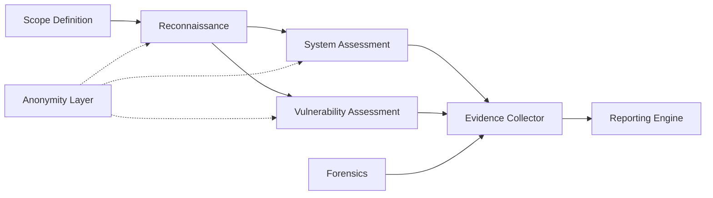

# RedBoot — Technical Architecture

> **Version:** 1.0.0  
> **Status:** Phase 1 — Foundation  
> **Last Updated:** 2026-09-30

---

## 1. System Overview

RedBoot is an academic, bootable security-assessment and forensic-analysis environment designed for **authorized, isolated laboratory use only**. It consolidates reconnaissance, vulnerability assessment, system assessment, anonymity/non-traceability controls, digital forensics, evidence collection, and reporting into a single bootable platform.

### 1.1 Design Principles

| Principle | Description |
|---|---|
| **Modularity** | Each capability is an independent module with a defined interface. |
| **Incremental Build** | Modules are developed, tested, and integrated one at a time. |
| **Forensic Integrity** | All evidence operations preserve chain-of-custody and use cryptographic hashing. |
| **Authorized Use Only** | Every tool enforces scope controls; the platform is designed exclusively for controlled lab environments. |
| **Non-Traceability** | As specified by the academic business case, assessment operations support anonymity to simulate real-world threat-actor behavior in a lab setting. |
| **Reproducibility** | Lab scenarios are scripted and repeatable for academic evaluation. |

---

## 2. High-Level Architecture

```
┌─────────────────────────────────────────────────────────────┐
│                     RedBoot Platform                        │
│                                                             │
│  ┌──────────┐  ┌──────────────┐  ┌───────────────────────┐ │
│  │  Boot    │  │  Core Engine │  │  Reporting Engine     │ │
│  │  System  │──│  (Orchestr.) │──│  (HTML/PDF/JSON)      │ │
│  └──────────┘  └──────┬───────┘  └───────────────────────┘ │
│                       │                                     │
│       ┌───────────────┼───────────────┐                     │
│       │               │               │                     │
│  ┌────▼─────┐   ┌─────▼──────┐  ┌────▼──────┐             │
│  │  Recon   │   │  Assess.   │  │ Forensics │             │
│  │  Module  │   │  Modules   │  │  Module   │             │
│  └──────────┘   └────────────┘  └─────┬─────┘             │
│                                       │                     │
│                                 ┌─────▼──────┐             │
│                                 │  Evidence   │             │
│                                 │  Collector  │             │
│                                 └────────────┘             │
│                                                             │
│  ┌────────────────────────────────────────────────────────┐ │
│  │            Anonymity / Non-Traceability Layer          │ │
│  └────────────────────────────────────────────────────────┘ │
└─────────────────────────────────────────────────────────────┘
```

---

## 3. Module Responsibilities

### 3.1 Boot System (`boot/`)

| Aspect | Detail |
|---|---|
| **Purpose** | Provide a self-contained, bootable Linux environment from USB/ISO. |
| **Base** | Debian-based live system (custom live-build configuration). |
| **Responsibilities** | Hardware detection, filesystem mounting (read-only by default), network configuration, tool pre-loading. |
| **Key Files** | `boot/live-build/`, `boot/config/`, `boot/scripts/` |

### 3.2 Reconnaissance Module (`modules/reconnaissance/`)

| Aspect | Detail |
|---|---|
| **Purpose** | Gather information about target systems within the authorized lab scope. |
| **Capabilities** | Network scanning, service enumeration, OS fingerprinting, DNS enumeration. |
| **Interfaces** | Accepts target scope definition (IP ranges, domains); outputs structured scan results (JSON). |
| **Key Integrations** | Wraps/orchestrates tools like Nmap, DNS utilities. |
| **Constraints** | Enforces scope validation — refuses to scan targets outside the defined lab range. |

### 3.3 System Assessment Module (`modules/system-assessment/`)

| Aspect | Detail |
|---|---|
| **Purpose** | Evaluate system configurations, access controls, and security posture. |
| **Capabilities** | Password policy analysis, user/group enumeration, service configuration audit, file permission checks. |
| **Interfaces** | Accepts system access credentials (lab-only); outputs assessment findings (JSON). |
| **Constraints** | Operates only on systems within authorized scope. |

### 3.4 Vulnerability Assessment Module (`modules/vulnerability-assessment/`)

| Aspect | Detail |
|---|---|
| **Purpose** | Identify known vulnerabilities in target systems. |
| **Capabilities** | CVE scanning, service version matching, configuration weakness detection, exploit-availability flagging. |
| **Interfaces** | Consumes reconnaissance output; produces vulnerability report (JSON with severity ratings). |
| **Key Integrations** | Wraps vulnerability scanners; cross-references CVE databases. |
| **Constraints** | Assessment only — does not exploit. Exploitation is a separate, gated lab activity. |

### 3.5 Anonymity / Non-Traceability Module (`modules/anonymity/`)

| Aspect | Detail |
|---|---|
| **Purpose** | Demonstrate and implement non-traceable assessment techniques as specified in the academic business case. |
| **Capabilities** | Traffic routing through anonymizing proxies, MAC address management, DNS leak prevention, identity compartmentalization. |
| **Interfaces** | Provides a network abstraction layer that other modules route through. |
| **Constraints** | **Lab use only.** Demonstrates concepts for academic study of how threat actors avoid detection. |

### 3.6 Forensics Module (`modules/forensics/`)

| Aspect | Detail |
|---|---|
| **Purpose** | Perform digital forensic analysis on disk images, memory dumps, and log files. |
| **Capabilities** | Disk imaging (bit-for-bit), file carving, timeline analysis, log correlation, metadata extraction. |
| **Interfaces** | Accepts evidence sources; outputs forensic findings (structured JSON + human-readable report). |
| **Key Principle** | **Read-only access** — never modifies source evidence. |

### 3.7 Evidence Collection Module (`modules/evidence/`)

| Aspect | Detail |
|---|---|
| **Purpose** | Collect, catalogue, and preserve digital evidence with integrity guarantees. |
| **Capabilities** | SHA-256 hashing of all evidence, chain-of-custody logging, tamper-evident storage, timestamping. |
| **Interfaces** | All other modules submit findings here; evidence store is append-only. |
| **Key Principle** | Cryptographic integrity — every piece of evidence is hashed and logged at ingest time. |

### 3.8 Reporting Engine (`reporting/`)

| Aspect | Detail |
|---|---|
| **Purpose** | Generate professional security assessment and forensic reports. |
| **Capabilities** | HTML, PDF, and JSON report generation; executive summaries; technical detail sections; evidence appendices. |
| **Interfaces** | Consumes structured output from all modules; produces final deliverable reports. |
| **Templates** | Jinja2-based templates for consistent formatting. |

### 3.9 Laboratory / Test Scenarios (`lab/`)

| Aspect | Detail |
|---|---|
| **Purpose** | Provide controlled, repeatable lab environments for demonstrating each module. |
| **Capabilities** | Docker-compose based vulnerable target systems, scenario scripts, expected-result baselines. |
| **Key Principle** | All demonstrations run in **isolated, authorized environments** with no external network access. |

---

## 4. Data Flow



### 4.1 Data Formats

All inter-module communication uses **JSON** as the canonical data format:

```json
{
  "module": "reconnaissance",
  "timestamp": "2026-09-30T12:00:00Z",
  "scope": "192.168.56.0/24",
  "findings": [],
  "metadata": {
    "operator": "lab-user",
    "session_id": "uuid"
  }
}
```

---

## 5. Technology Stack

| Layer | Technology |
|---|---|
| **OS Base** | Debian 12 (Bookworm) Live |
| **Language** | Python 3.11+ (primary), Bash (boot scripts) |
| **Package Management** | pip + requirements.txt per module |
| **Testing** | pytest, unittest |
| **Reporting** | Jinja2 templates → HTML → WeasyPrint (PDF) |
| **Lab Environments** | Docker, docker-compose |
| **CI/CD** | GitHub Actions |
| **Version Control** | Git |

---

## 6. Security and Ethical Constraints

> [!CAUTION]
> RedBoot is an academic project. All tools and capabilities are designed **exclusively** for use in authorized, isolated laboratory environments. Unauthorized use against systems you do not own or have explicit permission to test is illegal and unethical.

1. **Scope enforcement** — Every assessment module validates targets against a defined scope before execution.
2. **Audit logging** — All operations are logged with timestamps and operator identity.
3. **Read-only forensics** — Forensic operations never modify source evidence.
4. **Lab isolation** — Lab environments are network-isolated with no route to production systems.
5. **Academic purpose** — The anonymity module exists to study and document non-traceability concepts as required by the academic business case, not to facilitate unauthorized activity.

---

## 7. Development Phases

| Phase | Focus | Deliverables |
|---|---|---|
| **1** | Architecture & Foundation | Repository structure, architecture docs, CI pipeline |
| **2** | Bootable Environment | Live-build config, boot scripts, base ISO |
| **3** | Assessment Engine | Reconnaissance, system assessment, vulnerability assessment modules |
| **4** | Forensic Capabilities | Forensics module, evidence collection, integrity verification |
| **5** | Reporting | Report templates, generation engine, export formats |
| **6** | Lab & Experiments | Docker lab environments, scenario scripts, demonstrations |
| **7** | Documentation & Evaluation | Final-year report, user guide, academic evaluation materials |

---

## 8. Directory Map

```
redboot-security-lab/
├── README.md                    # Project overview
├── LICENSE                      # MIT License
├── CONTRIBUTING.md              # Contribution guidelines
├── CHANGELOG.md                 # Version history
├── .gitignore                   # Git ignore rules
├── docs/                        # Documentation
│   ├── architecture/            # Architecture documents
│   ├── user-guide/              # User guide
│   └── academic/                # Academic deliverables
├── boot/                        # Bootable environment
│   ├── live-build/              # Debian live-build configuration
│   ├── config/                  # Boot-time configuration
│   └── scripts/                 # Boot-time scripts
├── modules/                     # Core modules
│   ├── __init__.py
│   ├── core/                    # Shared core (config, logging, scope)
│   ├── reconnaissance/          # Network reconnaissance
│   ├── system-assessment/       # System security assessment
│   ├── vulnerability-assessment/# Vulnerability scanning
│   ├── anonymity/               # Non-traceability layer
│   ├── forensics/               # Digital forensics
│   └── evidence/                # Evidence collection & integrity
├── reporting/                   # Report generation engine
├── lab/                         # Lab environments & scenarios
│   ├── docker/                  # Docker-compose targets
│   └── scenarios/               # Scripted lab scenarios
├── scripts/                     # Utility scripts
├── tests/                       # Test suite
│   ├── unit/                    # Unit tests
│   └── integration/             # Integration tests
└── .github/                     # GitHub configuration
    └── workflows/               # CI/CD workflows
```
